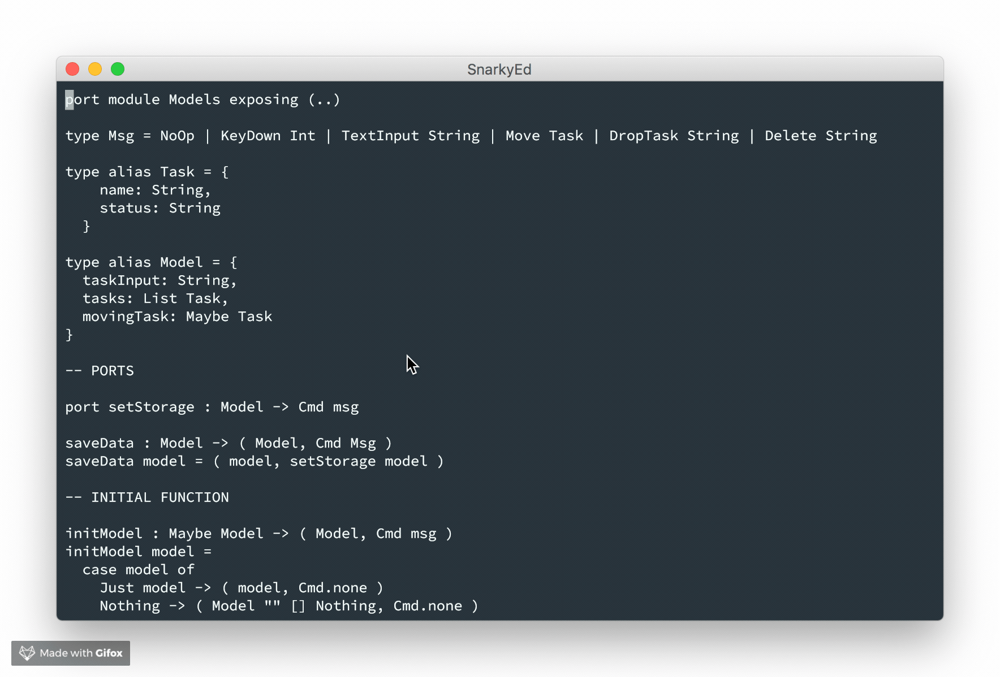

# SnarkyEd

GPU rendered text editor written in Rust, backed by Rope data structure.

Why? Because why not? it's a long weekend.



Keybinding:

```
h/j/k/l:  Line and character movement
    0/$:  Move to begin/end of line
C-j/C-k:  Scroll up/down 10 lines
```

It's barely functional now.